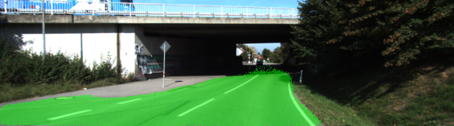

# RoadlaneSegmentation
Conduct a road lane segmentation using VGG16 and tensorflow


### Introduction
This project deals with road lane segmentation problem based on VGG16 and tensorflow. 
### Data
The data we are using is [Kitti Road dataset](http://www.cvlibs.net/datasets/kitti/eval_road.php) which can be downloaded from [here](http://www.cvlibs.net/download.php?file=data_road.zip). Then you can extract the dataset in `data` folder. A datafolder named 'dataroad' will contain training set and test set.

<p align="center">
 
 <br>Qualitative results.
</p>


### Setup
##### Frameworks and Packages
Make sure you have the following is installed:
 - [Python 3](https://www.python.org/)
 - [TensorFlow](https://www.tensorflow.org/)
 - [NumPy](http://www.numpy.org/)
 - [SciPy](https://www.scipy.org/)


### Run

Run the following command to run the project:
```
python main.py
```
**Note** If running this in Jupyter Notebook system messages, such as those regarding test status, may appear in the terminal rather than the notebook.
